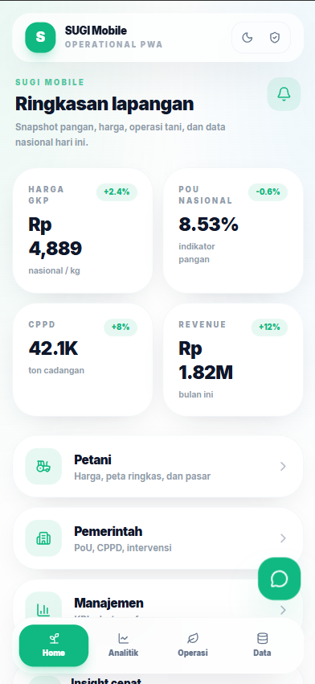
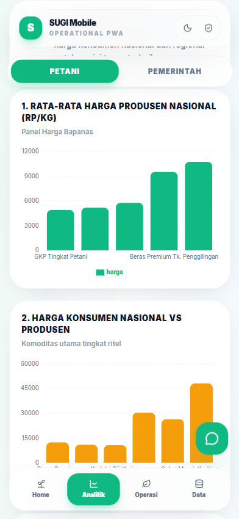
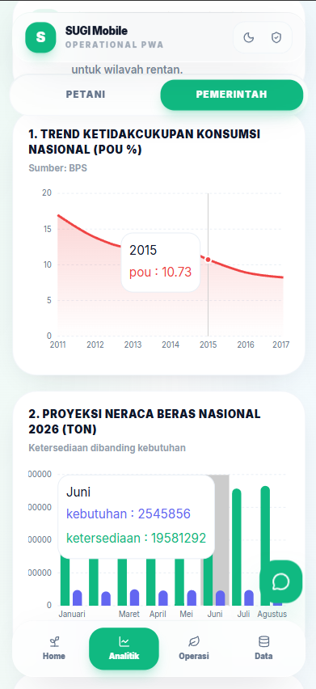
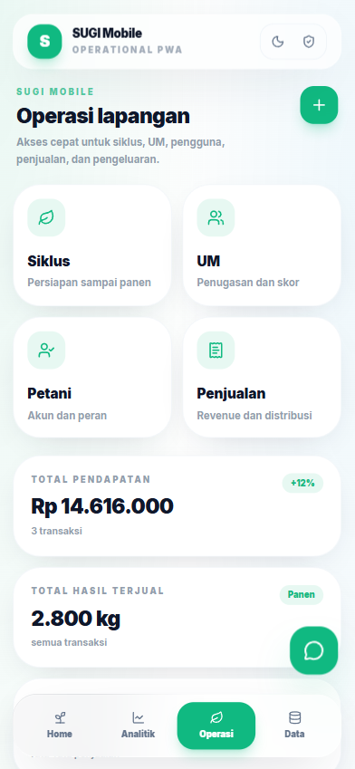
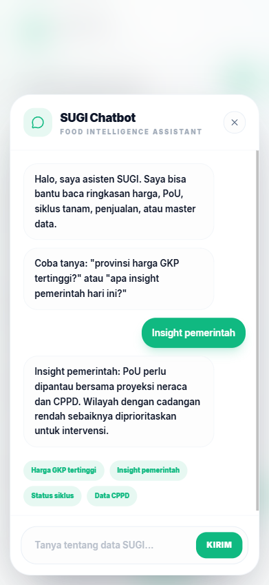

# SUGI Mobile PWA Dashboard

Aplikasi Progressive Web App (PWA) dashboard mobile untuk monitoring dan manajemen data operasional SUGI (Sistem Unggulan Gizi Indonesia).

## 📱 Fitur Utama

- **Dashboard Analytics** - Visualisasi data KPI dengan grafik interaktif
- **Data Registry** - Manajemen dan tracking data operasional
- **Alerts & Notifications** - Sistem notifikasi real-time
- **Food Security Monitoring** - Monitoring ketahanan pangan
- **Sales Management** - Tracking penjualan dan transaksi
- **User Management** - Manajemen data pengguna
- **Offline Support** - Aplikasi bekerja offline dengan service worker
- **Mobile Optimized** - Dioptimalkan untuk perangkat mobile dengan Tailwind CSS

## � Screenshots

### Home - Dashboard Utama



Halaman utama menampilkan overview sistem dan navigasi ke berbagai fitur utama.

### Analitik Petani



Dashboard analitik khusus untuk monitoring data dan metrik petani, meliputi produktivitas dan status kesehatan ternak.

### Analitik Pemerintah



Dashboard tingkat pemerintah untuk monitoring ketahanan pangan nasional dan data agregat operasional.

### Operasi Lapangan



Interface untuk monitoring dan manajemen operasional di lapangan secara real-time.

### Chatbot



Fitur chatbot untuk membantu pengguna dengan pertanyaan dan support real-time.

## ��️ Tech Stack

- **Frontend Framework**: React 19.2.4
- **Build Tool**: Vite 8.0.1
- **Styling**: Tailwind CSS 4.2.2
- **Routing**: React Router DOM 7.13.1
- **Charts**: Recharts 3.8.0
- **Icons**: Lucide React 0.577.0
- **Language**: JavaScript (ES Modules)

## 🚀 Instalasi

1. Clone repository ini:

```bash
git clone <repository-url>
cd SUGI-PWA\ Dashboard
```

2. Install dependencies:

```bash
npm install
```

3. Jalankan development server:

```bash
npm run dev
```

Server akan berjalan di `http://127.0.0.1:5174`

## 📦 Scripts Tersedia

| Script            | Deskripsi                                  |
| ----------------- | ------------------------------------------ |
| `npm run dev`     | Menjalankan development server (port 5174) |
| `npm run build`   | Build aplikasi untuk production            |
| `npm run preview` | Preview production build secara lokal      |

## 📁 Struktur Project

```
SUGI-PWA Dashboard/
├── index.html                 # Entry point HTML
├── package.json              # Dependency management
├── vite.config.js            # Konfigurasi Vite
├── postcss.config.js         # Konfigurasi PostCSS
├── public/
│   ├── manifest.webmanifest  # PWA manifest
│   └── service-worker.js     # Service worker untuk offline support
├── src/
│   ├── App.jsx               # Root component
│   ├── main.jsx              # Entry point React
│   ├── index.css             # Global styles
│   ├── data/
│   │   ├── features.js       # Definisi fitur & navigasi
│   │   └── mockData.js       # Data dummy untuk development
│   └── lib/
│       └── api.js            # Utility functions & API calls
└── README.md                 # Dokumentasi project
```

## 🎨 Design & UX

- **Color Scheme**: Green theme (#10b981) untuk branding
- **Responsive Design**: Mobile-first approach
- **Accessibility**: Support untuk web app capabilities
- **PWA Capabilities**:
  - Installable di home screen
  - Offline functionality
  - App-like experience

## 📊 Data Structure

### KPIs

Menampilkan metrik utama seperti:

- Total sales
- Active users
- Food security status
- Operational metrics

### Alerts

Sistem peringatan untuk:

- Kritical issues
- Data updates
- User notifications
- System alerts

### Features

Navigasi utama terdiri dari:

- Dashboard
- Data Registry
- Operations
- Settings

## 🔧 Konfigurasi PWA

Aplikasi dikonfigurasi sebagai PWA dengan:

- `manifest.webmanifest` - Konfigurasi web app
- `service-worker.js` - Caching dan offline support
- Meta tags di `index.html` - iOS dan Android support

## 📱 Browser Support

- Chrome/Edge 90+
- Firefox 88+
- Safari 14+ (iOS 14+)
- Samsung Internet 14+

## 🚀 Deployment

### Production Build

```bash
npm run build
```

Build output akan berada di folder `dist/`

### Preview Build

```bash
npm run preview
```

## 📝 Development Guidelines

1. **Components**: Letakkan React components di folder yang sesuai dengan feature
2. **Styling**: Gunakan Tailwind CSS classes untuk styling
3. **Data**: Update mock data di `src/data/mockData.js` untuk testing
4. **Icons**: Gunakan icons dari Lucide React library
5. **Routing**: Update routes di App.jsx menggunakan React Router

## 🤝 Contributing

1. Buat branch baru untuk fitur: `git checkout -b feature/nama-fitur`
2. Commit changes: `git commit -am 'Add fitur baru'`
3. Push ke branch: `git push origin feature/nama-fitur`
4. Buat Pull Request


## 👥 Author

SUGI BI Team - Digdaya Digital


**Last Updated**: June 2026
**Version**: 0.1.0
